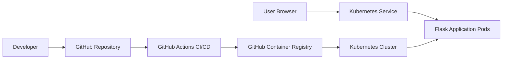

# kubernetes-application-deployment
Containerized application deployment using Docker, Kubernetes and GitHub Actions
# Kubernetes Application Deployment

[](https://github.com/ummadisettisindhuja2-netizen/kubernetes-application-deployment/actions/workflows/ci-cd.yml)

A hands-on DevOps portfolio project that packages a Python Flask application with Docker, deploys it to Kubernetes, and automates validation and image publishing through GitHub Actions.

## Architecture



## Project Features

* Containerized Python Flask application using Docker
* Kubernetes Deployment with two application replicas
* Kubernetes Service that routes traffic to the application
* Readiness and liveness health probes using `/health`
* CPU and memory requests and limits
* Non-root container user and restricted Linux capabilities
* GitHub Actions pipeline for Python validation, health testing, Docker build, and container-image publishing
* Docker image published to GitHub Container Registry

## Technologies Used

* Python and Flask
* Docker
* Kubernetes
* GitHub Actions
* GitHub Container Registry
* Gunicorn
* YAML
* Linux

## Project Structure

```text
.
├── .github/
│   └── workflows/
│       └── ci-cd.yml
├── k8s/
│   ├── deployment.yaml
│   └── service.yaml
├── app.py
├── Dockerfile
├── requirements.txt
├── .dockerignore
└── README.md
```

## Application Endpoints

| Endpoint  | Purpose                                                     |
| --------- | ----------------------------------------------------------- |
| `/`       | Displays the web application home page                      |
| `/health` | Returns the application health status for Kubernetes probes |

## Run Locally with Docker

Build the Docker image:

```bash
docker build -t kubernetes-web-app .
```

Run the container:

```bash
docker run -p 5000:5000 kubernetes-web-app
```

Open:

```text
http://localhost:5000
```

Test the health endpoint:

```text
http://localhost:5000/health
```

## Deploy to Kubernetes

Make sure `kubectl` is configured to connect to a Kubernetes cluster, such as Minikube, Amazon EKS, Google GKE, or Azure AKS.

Deploy the manifests:

```bash
kubectl apply -f k8s/
```

Verify the deployment:

```bash
kubectl get deployments
kubectl get pods
kubectl get services
```

Access the application locally through the Kubernetes service:

```bash
kubectl port-forward service/kubernetes-web-service 8080:80
```

Then open:

```text
http://localhost:8080
```

## CI/CD Pipeline

The GitHub Actions workflow runs automatically whenever code is pushed to the `main` branch or a pull request is opened.

The pipeline performs:

1. Checks out the repository.
2. Installs Python dependencies.
3. Validates the Python application.
4. Tests the `/health` endpoint.
5. Builds the Docker image.
6. Publishes the image to GitHub Container Registry.

## Security and Reliability Practices

* Uses a non-root user inside the Docker container
* Uses `.dockerignore` to prevent unnecessary files from entering the image
* Defines Kubernetes resource requests and limits
* Uses readiness and liveness probes for health monitoring
* Drops unnecessary Linux container capabilities
* Uses two replicas to improve application availability

## Skills Demonstrated

Docker | Kubernetes | Flask | Python | GitHub Actions | CI/CD | GitHub Container Registry | Container Security | Health Checks | YAML | Linux

## Author

**Sindhuja Ummadisetti**
Cloud & DevOps Engineer

* [GitHub Profile](https://github.com/ummadisettisindhuja2-netizen)
* [LinkedIn Profile](https://www.linkedin.com/in/ummadisetti-sindhuja-1201/)

## License

This project is licensed under the MIT License.
